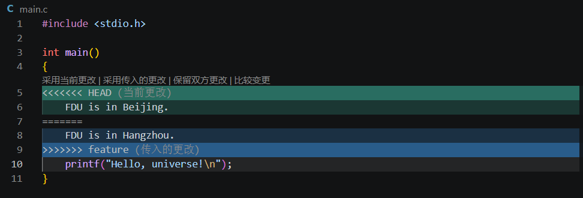

# Lab0 Git实验报告
1.有。每个开发者基于主分支新建独立的 feature 功能分支，在自己的分支上开发对应模块或功能，不直接修改 main 主分支。开发完成后将本地分支推送到远程，通过 Pull Request 提交合并请求，经过代码检查之后再合并到主分支。每个人负责不同功能模块，开发前拉取最新代码，开发完成提交，遇到代码冲突再人工解决。
2.工作目录下可能同时修改了多个文件，可以只把部分改动加入暂存区提交，不需要一次性把所有修改全部提交，可以把改动拆分成多个逻辑独立的提交，让版本历史更加清晰。暂存相当于提交前的 “准备区”，可以通过命令查看暂存区内容，确认本次要提交的内容是否正确，避免把调试代码、临时文件误提交到版本库。同一个文件中，可以只暂存文件里部分代码片段，而不是整个文件，实现细粒度的改动打包。因此把 “编辑文件” 和 “生成版本快照” 两件事分开，每次 commit 保存暂存区的快照，让版本记录更加整洁可读，方便后续回溯、查看历史。
3.git branch：只列出本地分支，只显示本机仓库创建的分支，当前正在使用的分支前面标记*号Git。
  git branch -a：列出全部分支，包含本地分支 + 远程跟踪分支。远程分支一般显示为remotes/origin/xxx形式，可以看到 GitHub 远程仓库上存在的所有分支信息Git。

阅读材料一概括：
这篇文章建立了一套清晰、可落地的 Git 提交规范体系，核心目标是通过结构化的提交信息提升团队协作效率、降低版本维护成本，同时给出了完整的工具链来降低规范的执行门槛，是国内 Git 工程实践领域的经典参考内容。

阅读材料二概括：
全文核心是 Gitflow 的五级分支体系，分为永久分支与临时分支两类。永久分支包括 master 和 develop：master 对应线上生产环境，仅存放正式发布版本，稳定性要求最高，每次更新都打上版本标签永久留存；develop 是开发集成分支，从 master 分离而来，是所有功能开发的公共基础分支。临时分支包括 feature、release、hotfix 三类：feature 分支从 develop 创建，一个分支对应一项新功能，开发完成后合并回 develop 并删除；release 分支在当期功能开发完成后从 develop 创建，用于测试、版本打磨与发版准备，测试通过后合并到 master 与 develop 并删除；hotfix 分支用于紧急修复线上生产 bug，直接从 master 创建，修复完成后同步合并到 master 和 develop。

Git是行业标准分布式版本控制工具。第一，它完整保存代码修改历史，代码改错可以随时回退版本，防止代码丢失；第二，分支机制支持同时做多套修改，方便开发新功能；第三，支持多人协作开发，多人可以并行修改同一个项目；第四，可以把代码上传到GitHub做备份，保存自己的项目作品。不管个人写代码还是团队项目，Git都是程序员必备工具。

Git 执行git merge时采用三路合并算法：它会找到两个分支的「共同祖先提交」，分别对比两个分支相对于祖先的改动。
如果两个分支修改的是不同行、不同位置的代码，Git 会自动把两处改动合并到一起，不会报错；
如果两个分支修改了同一个文件的同一行（或相邻的连续几行），并且修改成了不同的内容，Git 无法自动判断应该保留哪一个版本的代码，就会抛出CONFLICT (content)合并冲突，等待人工处理。

实验步骤
1. 配置WSL的SSH密钥，将公钥添加到GitHub账号，实现SSH免密访问GitHub。
2. 使用模板创建GitLab仓库，通过git clone将仓库克隆到WSL本地。
3. 修改main.c中printf输出语句，使用git add、git commit、git push，把修改提交推送到远程仓库，完成任务1。
4. 使用git switch -c feature创建并切换feature分支，修改main.c同一行代码并提交。
5. git switch main切回主分支，再次修改main.c的同一行代码并提交。
6. 执行git merge feature触发合并冲突，文件出现冲突标记。
7. 打开main.c，删除冲突标记，人工修改得到正确代码，保存文件。
8. git add main.c、git commit完成冲突解决提交，git push上传到GitHub远程仓库，完成任务2。

本次实验掌握了Git克隆、提交推送、分支创建切换、合并冲突产生与手动解决的流程。理解冲突产生条件：两个分支修改文件的同一行。熟悉WSL+Remote‑WSL开发环境，注意区分Windows磁盘文件与WSL内部文件，修改时要保证操作WSL内的文件，否则Git无法识别改动。
